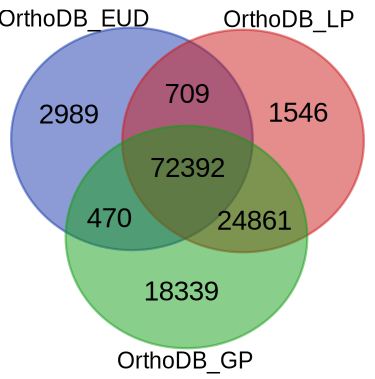
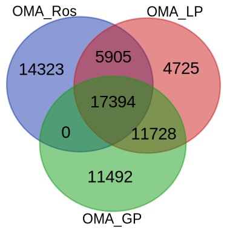

# Abstract

Orthologous genes for five plant genes are obtained using several orthology finder tools and the results are compared with each other, to figure out the differences of those tools.

Keywords: Arabidopsis, Orthologs, Soybean

# Introduction

Among the various biological resources, ortholog information can play a central role in integrating the biological data of multiple species [@Chiba2015].
Various orthology finding tools are available, but they provide different results.
It is important to examine the difference for plant research. Here, we selected five plant genes to figure out the differences of orthology finding tools. 

# Hackathon results

## Genes used for the analysis

We selected four genes from Arabidopsis and one gene from soybean (Table 1) for the analysis. The first two genes from *A. thaliana* (CAS1 and PDS3) are well-known genes conserved among higher plants. The latter two genes from *A. thaliana* (PAP1 and CYP716A1) and *G. max* CYP93E1 are genes involving the production of specialized metabolites. PAP1 is ... CYP716A1 is ... On the other hand, CYP93E1 is ...

Table: Gene list

| NCBI Gene ID | Locus tag | Gene symbol | Gene description |
| -------- | -------- | -------- | -------- |
| 815275 | AT2G07050 | CAS1 | cycloartenol synthase 1 |
| 827061 | AT4G14210 | PDS3 | phytoene desaturase 3 |
| 842120 | AT1G56650 | PAP1 | production of anthocyanin pigment 1 |
| 833607 | AT5G36110 | CYP716A1 | cytochrome P450, family 716, subfamily A, polypeptide 1 |
| 100037459 | GLYMA_08G350800 | CYP93E1 | beta-amyrin and sophoradiol 24-hydroxylase |

## Tools used for analysis 
OMA[@oma], OrthoDB[@orthodb], PGDBj, and Ensembl Plants are used to retrieve orthology information.

### OMA
Fhe following query is used to retrieve orthologs from OMA.
```
PREFIX oo: <http://purl.org/net/orth#>
PREFIX upTax: <http://purl.uniprot.org/taxonomy/>

SELECT DISTINCT ?member1 ?member2
WHERE {
  ?group oo:hasHomologousMember+ ?member1 , ?member2 .
  ?group oo:hasTaxonomicRange upTax:33090 . # Viridiplantae
  ?member1 a oo:Protein .
  ?member2 a oo:Protein .
  ?member1 oo:organism <https://omabrowser.org/oma/genome/3702> .
  ?member2 oo:organism <https://omabrowser.org/oma/genome/3847> .
}
```

### OrthoDB
Fhe following query is used to retrieve orthologs from OrthoDB.
```
PREFIX orthodb: <http://purl.orthodb.org/>
PREFIX upTax: <http://purl.uniprot.org/taxonomy/>
PREFIX rdfs: <http://www.w3.org/2000/01/rdf-schema#>
PREFIX up: <http://purl.uniprot.org/core/>
PREFIX obo: <http://purl.obolibrary.org/obo/>

SELECT DISTINCT ?entrez_id1 ?entrez_id2
WHERE {
  ?group orthodb:ogBuiltAt upTax:71240 . # eudicots
  ?group orthodb:hasMember ?member1 , ?member2 .
  ?member1 rdfs:seeAlso ?member_entrez1 ;
      up:organism ?odb_organism1 .
  ?member2 rdfs:seeAlso ?member_entrez2 ;
      up:organism ?odb_organism2 .
  ?odb_organism1 obo:RO_0002162 upTax:3702 . # Arabi
  ?odb_organism2 obo:RO_0002162 upTax:3847 . # soy
  ?member_entrez1 a orthodb:Entrez ;
      rdfs:label ?entrez_id1 .
  ?member_entrez2 a orthodb:Entrez ;
      rdfs:label ?entrez_id2 .
}
```

### PGDBj
CYP716A1 and CYP93E1 were searched in the Ortholog Database of PGDBj (http://pgdbj.jp/od2/search_33090.html). This database can be searched using RefSeq IDs, so NP_198460.1 (CYP716A1) and NP_001236154.1 (CYP93E1) were searched. The database returned the results by showing the Cluster ID containing the query sequence at various clades or species. The smallest clade containing both Arabidopsis and soybean is rosids (NCBI Taxonomy ID 71275). The results for CYP716A1 and CYP93E1 at the upper clades than rosids were identical for CYP716A1 and CYP93E1, indicating CYP716A and CYP93E families can not be distinguishable in the Ortholog Database of PGDBj.

### Ensembl Plants
Pairs of orthologous genes (55,316 gene pairs) between Arabidopsis and soybean were retreaved from the FTP site of EnsemblPlants release 54 (http://ftp.ebi.ac.uk/ensemblgenomes/pub/plants/release-54/tsv/ensembl-compara/homologies/glycine_max/Compara.107.protein_default.homologies.tsv.gz).

## Comparison of the tools

OrthoDB (see figure \ref{fig}).





# Discussion

We compared the search results of OMA, OrthoDB, PGDBj, and Ensembl Plants for five plant genes. We observed substantial difference of the results among the tools. PGDBj seems to detect many paralogs compared to others. OMA and OrthoDB has functionality of controlling the taxonomic range for orthology detection, and changing the range affected the search results. In some cases, the effect of the taxonimc range makes it difficult to interpret the search results by practical scientists. By manual inspection of the results, we confirmed that OrthoDB produces reasonable results at the current status.


# Future work
The conclusion will be generalized to other genes of plant species.
The orthology relations will be used in the RefEx, which is a web tool for browsing reference gene expression. The RefEx project is developing a successor website (RefEx2), which will contain expression datasets from diverse species. Since Arabidopsis is widely used as a model organism for plants, it is expected to be included in RefEx2 as a reference for plant gene expression data sets. The survey results will be an important resource for the RefEx2 website, which plans to link each gene search result to its orthologous relationship to related plant or other species. The survey results will be an important resource for the RefEx2 website, which plans to link each gene search result to its orthologous relationship to related plant or other species.

# GitHub repository
https://github.com/hchiba1/rois-ds-joint-tamura

# Acknowledgements
We thank the participants of BH22.9 (domestic biohackathon in Japan) for giving us the chance to discuss on this issue.
This work was supported under the ROIS-DS-JOINT No.003RP2022.
# References
