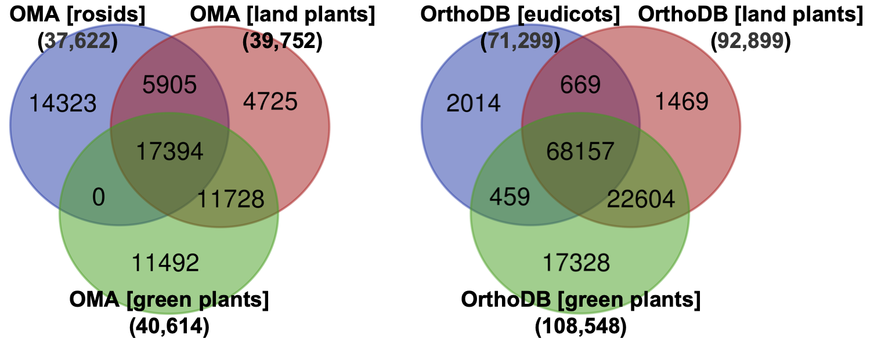

# Abstract

Orthologous genes for five plant genes are obtained using several orthology finder tools and the results are compared with each other, to figure out the differences of those tools.

Keywords: Arabidopsis, Orthologs, Soybean

# Introduction

Ortholog information is a valuable resource in integrating biological data from multiple species [@Chiba2015].
Various orthology finding tools are available; however, they provide different results, making it important to examine these differences in plant research.
Although a benchmarking tool, such as LEMOrtho (https://lemortho.ezlab.org) [@orthodb], which uses standardized gene sets for the comparison of various orthology finding tools, is available, it is also essential to compare these tools by selecting specific genes of interest.
In this study, we focused on five plant genes with different degrees of conservation, specifically in Arabidopsis (*Arabidopsis thaliana*) and soybean (*Glycine max*), to determine the differences in orthology finding tools.

# Hackathon results

## Genes used for the analysis

For the analysis, we selected four genes from Arabidopsis and one gene from soybean (Table 1).
The first two Arabidopsis genes, CAS1 and PDS3, are essential genes for plant survival.
CAS1 is a cycloartenol synthase necessary for the production of essential plant sterols [@corey1993isolation], while PDS3 is a phytoene desaturase essential for carotenoid production, the pigments necessary for various physiological processes in plants, including photosynthesis [@qin2007disruption].
The latter three genes are involved in specialized metabolite production.
PAP1 (Production of Anthocyanin Pigment 1) is a MYB transcription factor (also known as AtMYB75) that regulates anthocyanin biosynthesis [@borevitz2000activation].
CYP716A1 and CYP93E1 are cytochrome P450 monooxygenases involved in triterpenoid biosynthesis.
CYP716A1 is a member of the CYP716A subfamily that has been isolated from various plant species. It plays a role in the oxidation of pentacyclic triterpene skeletons, including beta-amyrin at the C-28 position [@yasumoto2016novel]. 
In contrast, members of the CYP93E subfamily have only been isolated from Fabaceae plants [@seki2015p450s].
Soybean CYP93E1 is responsible for the oxidation of beta-amyrin and sophoradiol at the C-24 position [@shibuya2006identification].

Table: Gene list

| NCBI Gene ID | Locus tag | Gene symbol |
| ------------ | --------- | ----------- |
| 815275 | AT2G07050 | CAS1 |
| 827061 | AT4G14210 | PDS3 |
| 842120 | AT1G56650 | PAP1 |
| 833607 | AT5G36110 | CYP716A1 |
| 100037459 | GLYMA_08G350800 | CYP93E1 |

## Tools used for analysis
We used OMA (https://omabrowser.org) [@oma], OrthoDB (https://www.orthodb.org) [@orthodb], Ortholog Database at PGDBj (http://pgdbj.jp) [@asamizu2014plant], and Ensembl Plants (https://plants.ensembl.org) [@yates2022ensembl] to retrieve orthology information. However, we did not analyze PGDBj in detail as it is not maintained since September 2016 and uses an outdated version of RefSeq (RefSeq Release 66, July 15, 2014).

### OMA
We used the following query to retrieve orthologs from OMA. We used several taxonomic ranges, including Viridiplantae (green plants, taxonomy ID 33090), Embryophyta (land plants, taxonomy ID 3193), and rosids (taxonomy ID 71275).
```
PREFIX oo: <http://purl.org/net/orth#>
PREFIX upTax: <http://purl.uniprot.org/taxonomy/>

SELECT DISTINCT ?member1 ?member2
WHERE {
  ?group oo:hasHomologousMember+ ?member1 , ?member2 .
  ?group oo:hasTaxonomicRange upTax:33090 . # Viridiplantae
  ?member1 a oo:Protein .
  ?member2 a oo:Protein .
  ?member1 oo:organism <https://omabrowser.org/oma/genome/3702> .
  ?member2 oo:organism <https://omabrowser.org/oma/genome/3847> .
}
```

### OrthoDB
We used the following query to retrieve orthologs from OrthoDB. We used several taxonomic ranges, including Viridiplantae (green plants, taxonomy ID 33090), Embryophyta (land plants, taxonomy ID 3193), and eudicotyledons (eudicots, taxonomy ID 71240).
```
PREFIX orthodb: <http://purl.orthodb.org/>
PREFIX upTax: <http://purl.uniprot.org/taxonomy/>
PREFIX rdfs: <http://www.w3.org/2000/01/rdf-schema#>
PREFIX up: <http://purl.uniprot.org/core/>
PREFIX obo: <http://purl.obolibrary.org/obo/>

SELECT DISTINCT ?entrez_id1 ?entrez_id2
WHERE {
  ?group orthodb:ogBuiltAt upTax:71240 . # eudicots
  ?group orthodb:hasMember ?member1 , ?member2 .
  ?member1 rdfs:seeAlso ?member_entrez1 ;
      up:organism ?odb_organism1 .
  ?member2 rdfs:seeAlso ?member_entrez2 ;
      up:organism ?odb_organism2 .
  ?odb_organism1 obo:RO_0002162 upTax:3702 . # Arabi
  ?odb_organism2 obo:RO_0002162 upTax:3847 . # soy
  ?member_entrez1 a orthodb:Entrez ;
      rdfs:label ?entrez_id1 .
  ?member_entrez2 a orthodb:Entrez ;
      rdfs:label ?entrez_id2 .
}
```

### Ensembl Plants
We retrieved pairs of orthologous genes (55,356 gene pairs) between Arabidopsis and soybean from the FTP site of Ensembl Plants release 54 (http://ftp.ebi.ac.uk/ensemblgenomes/pub/plants/release-54/tsv/ensembl-compara/homologies/glycine_max/Compara.107.protein_default.homologies.tsv.gz). We then extracted the pairs related to the five genes for analysis.

## Comparison of the tools

We initially compared the impact of taxonomic range on orthology detection in OMA and OrthoDB (Figure 1). Since the smallest taxonomic group that includes both Arabidopsis and soybean is rosids (OMA) and eudicotyledons (OrthoDB), we evaluated these shared taxonomic groups as well as Embryophyta (land plants) and Viridiplantae (green plants). Our findings demonstrate that both tools identified more ortholog pairs with higher taxonomic group datasets. However, we did not observe a consistent incremental increase in ortholog detection. 




We also compared the number of ortholog pairs between Arabidopsis and soybean among OMA, OrthoDB, and Ensembl plants (Figure 2). OMA and OrthoDB were analyzed at the level of green plants or land plants. The highest number of ortholog pairs was found in OrthoDB, followed by Ensembl Plants, which had almost half as many pairs as OrthoDB.

Next, we compared orthology detection in the three tools by focusing on the five plant genes. The results are shown in Figures 2–6. In each table, OMA and OrthoDB (ODB) show the results for green plants and land plants, separated by a comma (green plants, land plants). Additionally, "N/A" in the NCBI Gene ID and Gene symbol indicate that the locus tag was not found in NCBI Gene.

For the identified orthologs of AT2G07050 (CAS1) in soybean, GLYMA_01G001300 was identified in all conditions (Table 2). OMA and OrthoDB identified more orthologs in green plants than in land plants. Specifically, OrthoDB in green plants identified 10 orthologs. GLYMA_07G001300 and GLYMA_08G225800 are characterized as beta-amyrin synthase [@takagi2011manipulation], while GLYMA_08G027000 and GLYMA_20G192700 are characterized as lupeol synthase [@PPR568134]. Cycloartenol synthase, beta-amyrin synthase, and lupeol synthase are classified as oxidosqualene cyclase. Therefore, it is suggested that OrthoDB's green plants classification method grouped these different types of oxidosqualene cyclases into one group.

The identified orthologs of AT4G14210 (PDS3) in soybean were identical among the tools and taxonomic levels (Table 3). GLYMA_18G003900 is a functionally characterized PDS in soybean [@bartley1991molecular], and GLYMA_18G003900 is annotated as its paralog in SoyBase (https://www.soybase.org).


Table: Identified orthologs of AT2G07050 (CAS1) in soybean.

| Locus tag | NCBI Gene ID | Gene symbol | OMA | ODB | EP |
| --------- | ------------ | ----------- | :---: | :---: | :---: |
| GLYMA_01G001300 | 548054 | LOC548054 | Y,Y | Y,Y | Y |
| GLYMA_01G001500 | 100784662 | LOC100784662 | Y,N | Y,Y | N |
| GLYMA_03G121300 | 100809670 | LOC100809670 | N,N | Y,N | N |
| GLYMA_03G121500 | 100810544 | LOC100810544 | N,N | Y,N | N |
| GLYMA_07G001300 | 547702 | AMS1 | N,N | Y,N | N |
| GLYMA_08G027000 | 100794151 | LOC100794151 | N,N | Y,Y | N |
| GLYMA_08G225800 | 100778398 | LOC100778398 | N,N | Y,N | N |
| GLYMA_15G065600 | 100797878 | LOC100797878 | N,N | Y,N | N |
| GLYMA_15G101800 | 100781065 | LOC100781065 | N,N | Y,N | N |
| GLYMA_15G223600 | N/A | N/A | Y,N | N,N | N |
| GLYMA_20G192700 | 100810400 | LOC100810400 | N,N | Y,Y | N |


Table: Identified orthologs of AT4G14210 (PDS3) in soybean.

| Locus tag | NCBI Gene ID | Gene symbol | OMA | ODB | EP |
| --------- | ------------ | ----------- | :---: | :---: | :---: |
| GLYMA_11G253000 | 100127420 | LOC100127420 | Y,Y | Y,Y | Y |
| GLYMA_18G003900 | 547970 | PDS1 | Y,Y | Y,Y | Y |


Table: Identified orthologs of AT1G56650 (PAP1) in soybean.

| Locus tag | NCBI Gene ID | Gene symbol | OMA | ODB | EP |
| --------- | ------------ | ----------- | :---: | :---: | :---: |
| GLYMA_07G037700 | 100101858 | LOC100101858 | N,N | Y,Y | N |
| GLYMA_07G141100 | 100809746 | LOC100809746 | N,N | Y,Y | N |
| GLYMA_09G234900 | 100778957 | LOC100778957 | N,N | Y,Y | Y |
| GLYMA_09G235000 | N/A | N/A | N,N | N,N | Y |
| GLYMA_09G235100 | 100780023 | R | N,N | Y,Y | Y |
| GLYMA_09G235300 | 100781091 | LOC100781091 | N,N | Y,Y | Y |
| GLYMA_13G226800 | 100802612 | LOC100802612 | N,N | Y,Y | N |
| GLYMA_15G176000 | 778159 | MYB121 | N,N | Y,Y | N |
| GLYMA_16G007100 | 547568 | LOC547568 | N,N | Y,Y | N |
| GLYMA_18G191200 | 100798101 | LOC100798101 | N,N | Y,Y | N |
| GLYMA_18G261700 | N/A | N/A | N,N | N,N | Y |
| GLYMA_18G262000 | 100792465 | LOC100792465 | N,N | Y,Y | Y |
| GLYMA_19G025000 | 100306270 | LOC100306270 | N,N | Y,Y | Y |


Table: Identified orthologs of AT5G36110 (CYP716A1) in soybean.

| Locus tag | NCBI Gene ID | Gene symbol | OMA | ODB | EP |
| --------- | ------------ | ----------- | :---: | :---: | :---: |
| GLYMA_05G166900 | 100778139 | LOC100778139 | Y,Y | N,Y | N |
| GLYMA_05G170400 | 100782971 | LOC100782971 | Y,Y | N,N | N |
| GLYMA_05G220500 | 100801007 | LOC100801007 | Y,Y | Y,Y | Y |
| GLYMA_08G026900 | 100813159 | LOC100813159 | Y,Y | Y,Y | Y |
| GLYMA_08G125000 | 100778750 | LOC100778750 | Y,Y | N,Y | N |
| GLYMA_08G125100 | 100808690 | LOC100808690 | Y,Y | N,Y | N |
| GLYMA_08G243600 | 100815640 | LOC100815640 | Y,Y | Y,Y | N |


Table: Identified orthologs of GLYMA_08G350800 (CYP93E1) in Arabidopsis.

| Locus tag | NCBI Gene ID | Gene symbol | OMA | ODB | EP |
| --------- | ------------ | ----------- | :---: | :---: | :---: |
| AT2G42250 | 818826 | CYP712A1 | N,N | Y,Y | N |
| AT5G06900 | 830580 | CYP93D1 | N,N | Y,Y | N |
| AT5G06905 | 830581 | CYP712A2 | N,N | Y,Y | N |


The identified orthologs of AT1G56650 (PAP1) in soybean were different between the tools (Table 4). OMA did not identified any orthologs, while OrthoDB and Ensembl Plants identified 11 and seven orthologs, respectively. As GLYMA_09G235000 and GLYMA_18G261700 were not included in the OrthoDB v10.1, OrthoDB identified all of the orthologs identified in Ensembl Plants.
The previous phylogenetic analysis of soybean MYB proteins identified seven genes clustered together with PAP1 (AtMYB75); namely, GmMYB192 (GLYMA_07G141100), GmMYB227 (GLYMA_09G235100), GmMYB241 (GLYMA_09G235300), GmMYB155 (GLYMA_18G191200), GmMYB008 (GLYMA_18G261700), GmMYB080, (GLYMA_18G262000), and GmMYB096 (GLYMA_19G025000) [@du2012genome].
OrthoDB identified all of these genes.

For AT5G36110 (CYP716A1), OMA identified seven orthologs, OrthoDB identified six (land plants) or three (green plants) orthologs, and Ensembl Plants identified two orthologs (Table 5). GLYMA_05G220500 and GLYMA_08G026900 were identified in all of the tools. In soybean, three CYP716A, three CYP716D, and one CYP716G subfamily genes are reported [@guttikonda2010whole].
By comparing the phylogenetic trees reported by [@guttikonda2010whole] and [@khatri2022comprehensive], and UniRef50 (UniProt Reference Clusters) of AT5G36110 (CYP716A1) contains three soybean entries including GLYMA_08G026900 and GLYMA_05G220500, it is expected that GLYMA_05G220500, GLYMA_08G026900, and GLYMA_08G043600 are the three CYP716A genes, and GLYMA_05G166900, GLYMA_08G125000, and GLYMA_08G125100 are the three CYP716D genes (the locus tag for one CYP716G gene is unknown).
OrthoDB (green plants) and Ensembl Plants identified all or two of the three CYP716A genes, while OMA and OrthoDB (land plants) identified all of the CYP716A as well as CYP716D genes.

Finally, for GLYMA_08G350800 (CYP93E1), only OrthoDB identified orthologs in soybean (Table 6). In Arabidopsis, a single CYP93 family gene (CYP93D1) is known, and the two CYP712A subfamily genes are relatively close relathionship to CYP93 [@bak2011cytochromes]. OrthoDB clustered these Arabidopsis P450s together, while OMA and Ensembl Plants did not.


# Discussion

We compared the search results of OMA, OrthoDB, and Ensembl Plants using the ortholog pairs between Arabidopsis and soybean, and performed the detailed analysis for the five genes.
We observed substantial difference of the results among the tools. OMA and OrthoDB has functionality of controlling the taxonomic range for orthology detection, and changing the range affected the search results. The number of detected ortholog pairs was increased in higher taxonomic ranges, however, it is not always the case that higher taxonomic ranges identified all of the ortholog pairs identified in lower taxonomic ranges.
By testing the five specific plant genes, althogh the nubmer of ortholog pairs were highest in OrthoDB, followed by Ensembl Plants and OMA, OrthoDB did not always detected the most orthologs among the three tools.
As we observed in the orthologs of AT5G36110 (CYP716A1), it is suggested that orthologs identified in multiple tools may be more reasonable ones. Hence, for the precise ortholog detection, it is important to use multiple tools and integrate the results.


# Future work
The orthology relations will be utilized within RefEx ([https://refex.dbcls.jp](https://refex.dbcls.jp)), a web-based tool that facilitates browsing of reference gene expression. The RefEx project is presently engaged in the development of a successor website (RefEx2), which will incorporate expression datasets from a range of species. The survey findings will constitute a significant resource for the RefEx2 website, which aims to establish links between each gene search result and its orthologous association with related plant or other species.

# GitHub repository
https://github.com/hchiba1/rois-ds-joint-tamura

# Acknowledgements
We thank the organizes and participants of BH22.9 (domestic biohackathon in Japan) for giving us the chance to discuss on this issue.
This work was supported by ROIS-DS-JOINT (003RP2022) to K.Tamura.

# References
